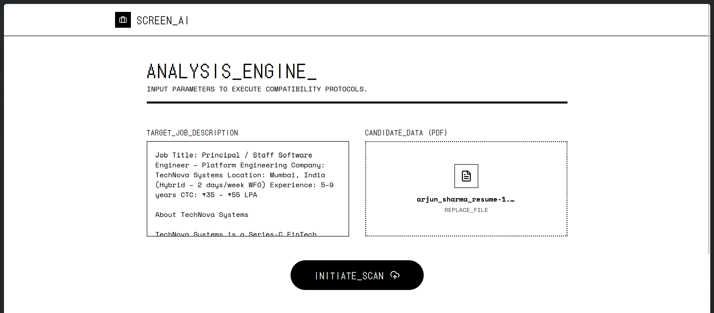
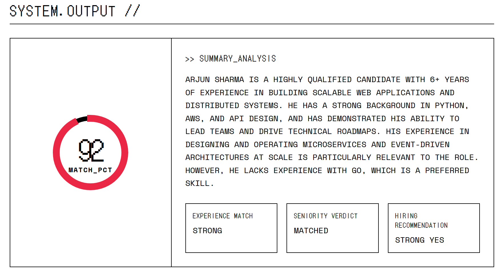
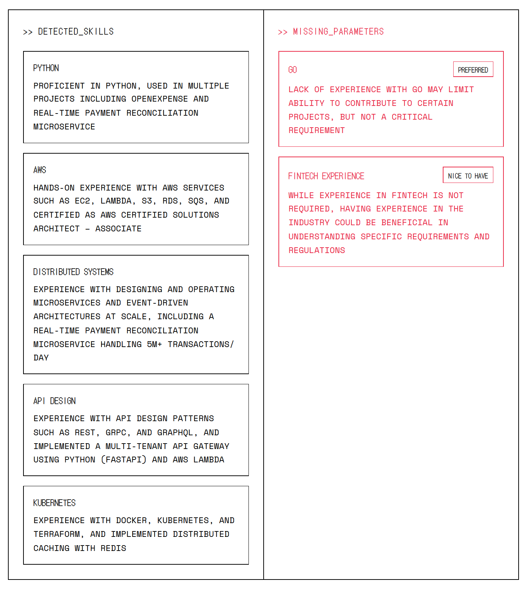
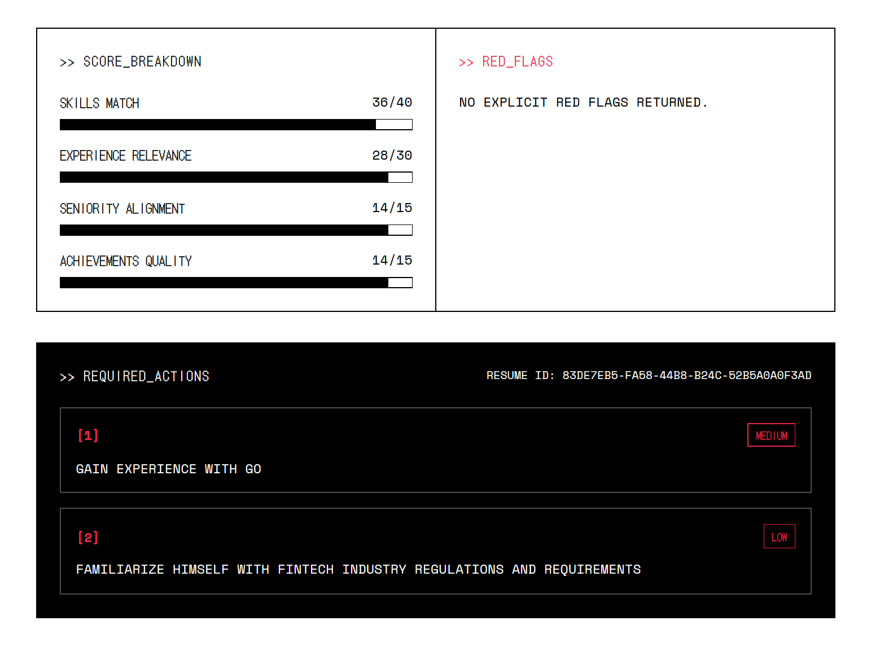

# Screen AI: AI Resume Screener

A full-stack AI resume screener that extracts text from PDF resumes in the browser, sends the resume plus a job description to an AWS Lambda API, and returns a strict ATS-style evaluation with detailed scoring, red flags, and hiring guidance.

The frontend is a React + Vite app. The backend is a Python Lambda function behind API Gateway that calls Groq securely with the `GROQ_API_KEY` stored server-side.

## Overview

Screen AI is built to simulate a strict screening workflow. A user pastes a job description, uploads a PDF resume, and receives:

- an overall match score
- a category score breakdown
- matched skills with evidence
- missing skills with impact and criticality
- experience and seniority verdicts
- red flags
- concrete improvement actions
- a hiring recommendation

## Preview

### Input Screen



### Results Overview



### Skills Analysis



### Score Breakdown And Actions



## Architecture

### Frontend

- React 19 + Vite 8 single-page app
- Tailwind CSS 4 for styling
- PDF.js loaded in the browser to extract resume text from uploaded PDFs
- Sends `jobDescription` and `resumeText` to the screening API
- Validates the minimum payload lengths expected by the backend

### API Layer

- Amazon API Gateway exposes the public endpoint
- Handles CORS and routes `OPTIONS` / `POST` requests to Lambda

### Backend

- Python `lambda_function.py` deployed on AWS Lambda
- Reads `GROQ_API_KEY` from environment variables
- Calls Groq chat completions with `llama-3.3-70b-versatile`
- Returns strict JSON output for the frontend dashboard

## Features

- Paste a target job description
- Upload or drag-and-drop a PDF resume
- Extract resume text client-side with PDF.js
- Validate short or missing input before sending requests
- Render a structured ATS result dashboard with:
  - score gauge
  - score breakdown
  - matched skills with evidence
  - missing skills with criticality and impact
  - experience match
  - seniority verdict
  - red flags
  - improvement actions with priority
  - hiring recommendation
  - generated `resumeId`

## Tech Stack

- React 19
- Vite 8
- Tailwind CSS 4 via `@tailwindcss/vite`
- Lucide React
- PDF.js via CDN
- AWS Lambda
- Amazon API Gateway
- Amazon S3 for static hosting
- Groq API with `llama-3.3-70b-versatile`

## API Contract

The frontend posts this payload:

```json
{
  "jobDescription": "string",
  "resumeText": "string"
}
```

### Backend Validation

- `jobDescription` is required and must be at least `50` characters
- `resumeText` is required and must be at least `100` characters

### Success Response Shape

```json
{
  "score": 78,
  "score_breakdown": {
    "skills_match": 28,
    "experience_relevance": 22,
    "seniority_alignment": 12,
    "achievements_quality": 8
  },
  "matched_skills": [
    {
      "skill": "React",
      "evidence": "Built and shipped dashboard components in a recent frontend role."
    }
  ],
  "missing_skills": [
    {
      "skill": "AWS",
      "criticality": "required",
      "impact": "The role expects production cloud deployment experience."
    }
  ],
  "experience_match": "moderate",
  "seniority_verdict": "matched",
  "red_flags": [
    "Claims leadership experience but gives no measurable outcomes."
  ],
  "summary": "Three-sentence evaluation.",
  "improvements": [
    {
      "action": "Add metrics to project bullets and describe direct ownership.",
      "priority": "high"
    }
  ],
  "hiring_recommendation": "maybe",
  "resumeId": "generated-uuid"
}
```

### Error Responses

The Lambda may return:

- `400` for missing or too-short inputs
- `502` if the AI response cannot be parsed as JSON
- `500` for other backend or upstream API errors

Each error response contains:

```json
{
  "error": "message"
}
```

## API Endpoint

The frontend currently posts to:

```txt
https://byka9fvisi.execute-api.ap-south-1.amazonaws.com/prod/screen
```

This value is currently hardcoded in `src/App.jsx`.

## Local Development

### Prerequisites

- Node.js 18+
- npm

### Install

```bash
npm install
```

### Run the Frontend

```bash
npm run dev
```

### Build the Frontend

```bash
npm run build
```

## Backend Deployment Notes

- Backend file: `lambda_function.py`
- Environment variable required: `GROQ_API_KEY`
- Lambda must allow `OPTIONS` and `POST` through API Gateway
- Frontend and backend must stay in sync on the JSON response schema

## Project Structure

```txt
ai-resume-screener/
├── public/
│   └── screenshots/
├── src/
│   ├── components/
│   │   ├── GaugeChart.jsx
│   │   ├── Header.jsx
│   │   ├── JobDescriptionInput.jsx
│   │   ├── PdfUploader.jsx
│   │   └── ResultsDashboard.jsx
│   ├── App.jsx
│   ├── index.css
│   └── main.jsx
├── index.html
├── lambda_function.py
├── package.json
└── vite.config.js
```

## Important Notes

- Resume parsing happens in the browser using PDF.js loaded from a CDN.
- Only PDF files are accepted by the uploader.
- The app depends on the external screening API being available and returning the expected JSON shape.
- There is currently no environment-variable based configuration for the API URL.
- The Groq API key is kept server-side in the Lambda backend and is not exposed in the frontend.

## Known Limitations

- Complex PDF layouts may extract imperfectly because the app collects text layer content page by page.
- If the hosted API changes its response format, the UI will break unless the frontend is updated too.
- The backend is hosted on AWS free-tier infrastructure, so availability and throughput may be limited.

## Backend Notes

- Backend file: `lambda_function.py`
- Model used: `Groq API with llama-3.1-8b-instant`
- Deployment target: AWS Lambda behind Amazon API Gateway
- Groq API key is read from the `GROQ_API_KEY` environment variable
- Lambda returns CORS headers for `OPTIONS,POST`
